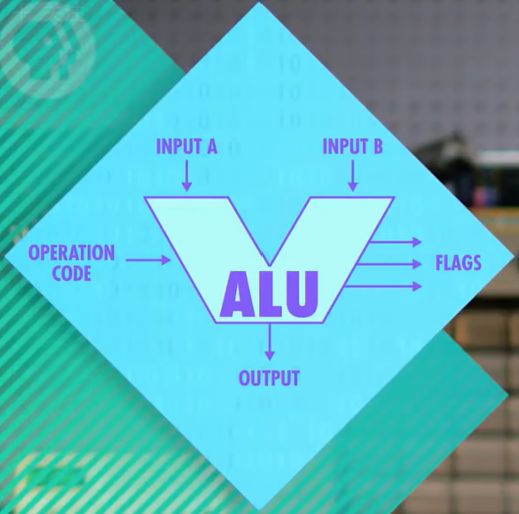

# Crash Course Computer Science

### 1. Early Computing

- 算盘 → 步进计算器 → 差分机 → 分析机 → 打孔卡片制表机

### 2. Electronic Computing

- 继电器(relay) → 真空管(vacuum tube) → 晶体管(transistor)

### 3. Boolean Logic & Logic Gates

- Not, And, Or, XOR

### 4. Binary

- 1 byte = 8 bits
- Use the first bit for the sign (1 for negative; 0 for positive)
- ASCII → Unicode

### 5. ALU (Algorithm & Logic Unit)

- arithmetic unit
    - half adder
    - full adder
    - 8-bit ripple carry adder
    - Carry-Look-Ahead adder
- logic unit
- illustration:
    
    
    

### 6. Registers and RAM

- latch
    - AND-OR latch
    - Gated latch
- Register: a group of latches
    - can hold a single number
    - The number of bits in a register is called its width
    - matrix for more bits with memory address
        - multiplexer: To convert from an address into something that selects the right row or column.
- Random Access Memory 随意存取存储器
    - Can access any memory location, at any time, and in a random order.

### 7. CPU（The Central Processing Unit)


- 概念：
    - **寄存器+控制单元+ALU+时钟**
    - 与**RAM**配合执行程序
    - CPU和RAM之间用“地址线”、”数据线“和”允许读/写线“通信
- 控制单元重要组件：
    - 指令表：给指令分配ID
    - 指令寄存器：存储当前指令
    - 指令地址寄存器：存储当前指令的内存地址
- 执行过程：
    1. 取指令 Fetch
    2. 解码 Decode
    3. 执行 Execute
- 时钟 Clock
    - 超频：加快CPU速度，可能过热或乱码
    - 降频：省电
    - 动态调整频率

### 8. Instructions and Programs

- 指令集：记录指令名称、用法、操作码以及所需RAM地址位数
- 常用指令：
    - LOAD：数据从RAM到寄存器
    - STORE：数据从寄存器到RAM
    - ADD
    - SUB
    - JUMP
        - 有条件JUMP如JUMP-negativ
    - HALT：停止
- 扩展指令长度：
    - 更多位
    - 可变指令长度
- 案例：


### 9. Advanced CPU Designs

- 减少晶体管切换时间
- 设计复杂电路：complexity vs speed
- 在CPU内设置缓存
    - 缓存命中/非命中
    - 脏位：缓存与RAM不一致的数据
    - 缓存同步：缓存已满时处理脏位
- 指令流水线
    - 并行执行
    - 数据依赖性？乱序执行
    - 条件跳转？推测执行、分支预测
- CPU多核、计算机多CPU

### 10. Early Programming

- Stored-program computers: store programs and data
    - e.g. Von Neumann Architecture
- plug boards → punch cards → panel programming

### 11. The First Programming Languages

- 二进制 → 助记符（汇编器）→ A-0（编译器）→ FORTRAIN
- machine code
- assembly code using assembler (汇编器)
- high-level programming code using compiler (编译器)

### 12. Programming Basics - Statements and Functions

- conditional statement: if
- loop: while; for
- function

### 13. Intro to Algorithms

- Big O Notation: complexity
- selection sort: O(n²)
- merge sort: O(n * log n)
- Dijkstra 算法

### 14. Data Structure

- Array 数组
- Struct 结构体
- Linked List 链表
    
    ```bash
    struct Node
    	variable i
    	pointer next  //指针
    ```
    
    - Queue 队列
        - FIFO: first in first out
        - enqueue 入队  dequeue 出队
    - Stack 栈
        - LIFO: last in first out
        - push 入栈  pop 出栈
- Tree 树：单向
    
    ```bash
    struct Node
    	variable i
    	pointer nextleft
    	pointer nextright
    ```
    
    - root 根节点  leaf 叶节点
- Graph 图：可循环

### 15. Alan Turing

- Turing Machine
    - State variable + rules + read/write head

### 16. Software Engineering

- Object Oriented Programming
    - object: related functions/code
    - e.g. C++ C# Java Python
- API: Application Programming Interface
- IDE: integrated development environment 集成开发环境
- Source Control  源代码管理    e.g. git
    - 代码存在中心服务器
- QA: Quality Assurance testing  质量保证测试

### 17. Integrated Circuits & Moore’s Law

- ICs: a group of components
- PCB(印刷电路板): printed circuit board
- chip technology:
    - 光刻、氧化、参杂…
- Moore’s Law: the number of transistors on a microchip doubles approximately every two years

### 18. Operating Systems (OS)

- 有操作硬件的特殊权限，可以运行和管理其它程序
- 一般是开机第一个启动的程序，其他所有程序都由操作系统启动
- 软件和硬件之间的媒介
- virtual memory → dynamic memory allocation
- Unix操作系统
    - kernal内核：核心功能，如内存管理、多任务输入/输出
    - 其他工具

### 19. Memory & Storage

- memory: non-permanent, volatile易失性    e.g. RAM
- storage存储器: non-volatile
    - delay line memory: sequential, 1 bit at one time
    - magnetic core memory
    - magnetic tape → hard disc drive
    - compact disc (CD): reflecting light
    - solid state drive (SDD): no need to move, fast

### 20. Files & File Systems

- file format
    - .txt  .wav   .bmp
- file system (using directory)
    - flap file system
    - hierarchical file system

### 21. Compression

- lossless compression
    - run-length encoding - removing redundancies
    - dictionary coders - Huffman Tree
    - e.g. GIF PNG PDF ZIP
- lossy compression
    - perceptual coding
    - e.g. lossy audio compression: MP3

### 22. Keyboards & Command Line Interfaces

- human-computer interaction: I/O
- keyboard (QWERTY)
- command line interfaces 命令行界面

### 23. Screens & 2D Graphics

- Cathode Ray Tubes (CRTs) 阴极射线管
    - vector scanning
    - raster scanning  光栅扫描
- Liquid Crystal Displays (LCDS) 液晶显示器
- Character Generator: a graphic card 显卡
    - Read Only Memory (ROM) 只读存储器: store graphics for each character, called a dot matrix pattern
    - Screen Buffer
- Sketchpad: an interactive graphical interface
    - offer Computer-Aided Design (CAD)
    - earliest complete graphical application

### 24. the Cold World and Consumerism

- history

### 25. the Personal Computer Revolution

- interpreter 解释器 vs compiler 编译器
    - interpreter: interpret while the program runs
    - compiler: compile before the program runs
- IBM Compatible: users can use the huge system of hardware and software

### 26. Graphical User Interface (GUI)

- point & click interface
- WIMP Interface
    - windows, icons, menus and a pointer
- Event-driven Programming

### 27. 3D Graphics

- 3D projection
    - wireframe rendering  线框渲染
        - orthographical projection  正交投影
        - perspective projection  透射投影
    - scanline rendering  扫描线渲染 : to fill graphics
        - Anti Aliasing 抗锯齿
        - Painter’s Algorithm: sort distance to determine occlusion
        - Z-Buffering
        - Back-Face Culling 背面剔除
    - shading 阴影
        - flat shading
        - Gouraud Shading
        - Phong Shading
    - Texture
- GPU: Graphic Processing Unit  图形处理单元

### 28. Computer Networks

- LAN: Local Area Network 局域网
    - Ethernet 以太网
    - MAC Address: Media Access Control Address, unique to every computer
- CSMA: Carrier Sense Multiple Access 载波侦听多路访问
    - Ethernet - copper wire
    - WiFi - air carrying radio waves
    - Bandwidth: the rate at which a carrier can transmit data
- Switch 交换机: connecting Collision Domains
- routing 路由
    - hop count 跳数
    - packets 数据包: to chop up big transmissions into many small pieces, called packets
- IP: Internet Protocol
    - defining the format of packet transmission
    - IP address

### 29. the Internet

- WAN: Wide Area Network 广域网
    - belongs to ISP (Internet Service Provider)
- UDP: User Datagram Protocol 用户数据报协议
    - IP gets the packet to the right computer
    - UDP gets the packet to the right program running on that computer （port 端口）
- TCP: Transmission Control Protocol 传输控制协议 - TCP/IP


- DNS: Domain Name System 域名系统
- layers of the OSI model:


### 30. the World Wide Web

- Hyperlink 超链接
- URL: Uniform Resource Locator 统一资源定位器
- HTTP: Hypertext Transport Protocol 超文本传输协议
- HTML: Hypertext Markup Language 超文本标记语言
- Net Neutrality 网络中立性

### 31. Cybersecurity

- Secrecy 保密性, Integrity 完整性, Availability 可用性
- Authentication 身份验证
    - what you know: e.g. username, password
    - what you have: e.g. physical key
    - what you are: e.g. fingerprint
- Access Control 访问控制
    - Bell LaPadula model: ban reading up or writing down

### 32. Hackers & Cyber Attacks

- common methods
    - Phishing 钓鱼
    - Pretexting 假托
    - Trojan Horses 木马
    - Nand Mirroring Nand镜像
    - Exploit 漏洞利用
        - Buffer Overflow  缓冲区溢出
        - Code Injection  代码注入
    - Worms 计算机蠕虫 - Botnet 僵尸网络
    - DDoS 拒绝服务攻击

### 33. Cryptography

- cryptography  密码学
    - cipher  加密算法
    - ciphertext  密文
    - encryption  加密
    - decryption  解密
- defense in depth
- Substitution Cipher 替换加密
- Permutation Cipher  移位加密
- Data Encryption Standard 数据加密标准
- Advanced Encryption Standard 高级加密标准
- Key Exchange 密钥交换
- Symmetric Encryption 对称加密(密钥一样) & Asymmetric Encryption

### 34. Machine Learning & Artificial Intelligence

- Neural Network
- Reinforced Learning - narrow AI

### 35. Computer Vision

- Convolution 卷积 with Kernel 核
- Convolution Neural Network

### 36. Natural Language Processing

- Phrase structure rules  短语结构规则
- Speech Recognition  语音识别
- Phoneme 音素
    - recognition - break down into phonemes
    - synthesis - combine phonemes

### 37. Robots

- CNC machines: Computer Numerical Control 计算机数控
- controller
    - negative loop
    - PID(Proportional–integral–derivative) controller
- Azimov’s Laws

### 38. Psychology of Computing

- usability 易用性
- affordance 直观功能

### 39. Educational Technology

- MOOC: Massive Open Online Course 大型开放式在线课程

### 40. the Singularity, Skynet and the Future of Computing

- ubiquitous computing: 普适计算
- singularity 奇点

### test some changes
